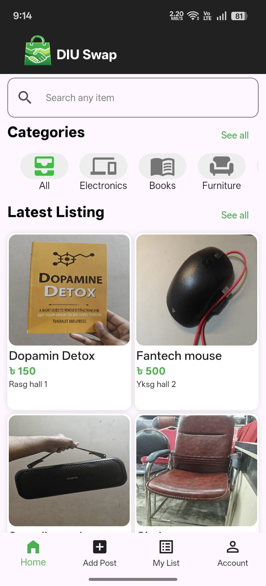
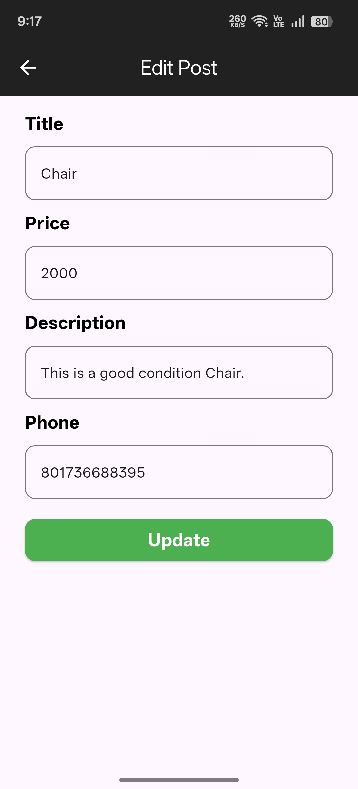
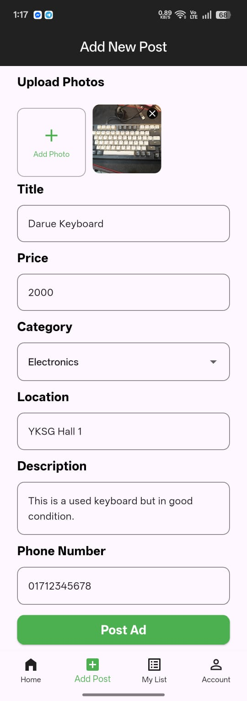
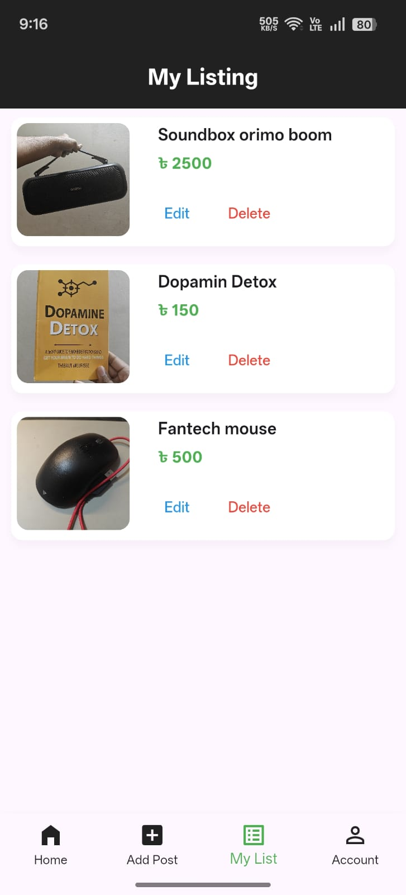
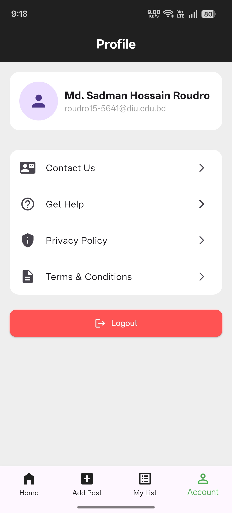
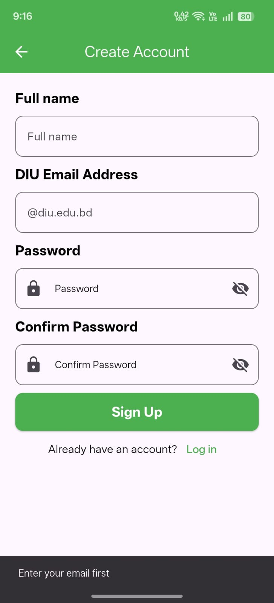

# DIU Swap 🛒

### Campus Marketplace App for DIU Students

A mobile marketplace application built with Flutter that enables Daffodil International University students to securely buy and sell items within campus.

---

## 🚀 Features

* 🔐 Secure user authentication (Login, Signup, Reset Password)
* 🎓 Restricted registration using DIU email (only Daffodil students allowed)
* 📦 Post, edit, and delete product listings
* ☁️ Image upload using Cloudinary
* 🔍 Real-time search functionality
* 🗂 Category-based filtering for better navigation
* 🔄 Real-time data handling using Firebase Firestore
* 🏠 Clean and user-friendly homepage

---
## 📸 Screenshots

  
  
  
  

  
  
  
  

---

## 🛠 Tech Stack

* Flutter (Dart)
* Firebase Authentication
* Firebase Firestore
* Cloudinary

---

## ⚙️ How It Works

* Users can register only using a valid DIU email address
* Firebase Authentication handles login, signup, and password reset
* Product data is stored and managed in Firebase Firestore
* Images are uploaded and served via Cloudinary
* Real-time updates ensure smooth user experience

---

## 🚀 Getting Started

1. Clone the repository
2. Run `flutter pub get`
3. Set up Firebase project and configuration
4. Configure Cloudinary credentials
5. Run the app using `flutter run`

---

## 📊 Key Highlights

* Built a real-time data-driven application with structured database design
* Implemented secure user authentication and access control
* Designed scalable product listing and filtering system
* Demonstrated strong data handling and workflow management

---

## 💡 Future Improvements

* Wishlist / Favorites feature
* In-app chat between buyers and sellers
* Pagination and performance optimization
* Admin panel for moderation

---

## 🔗 Project Link

GitHub Repository: ADD_YOUR_GITHUB_LINK_HERE
